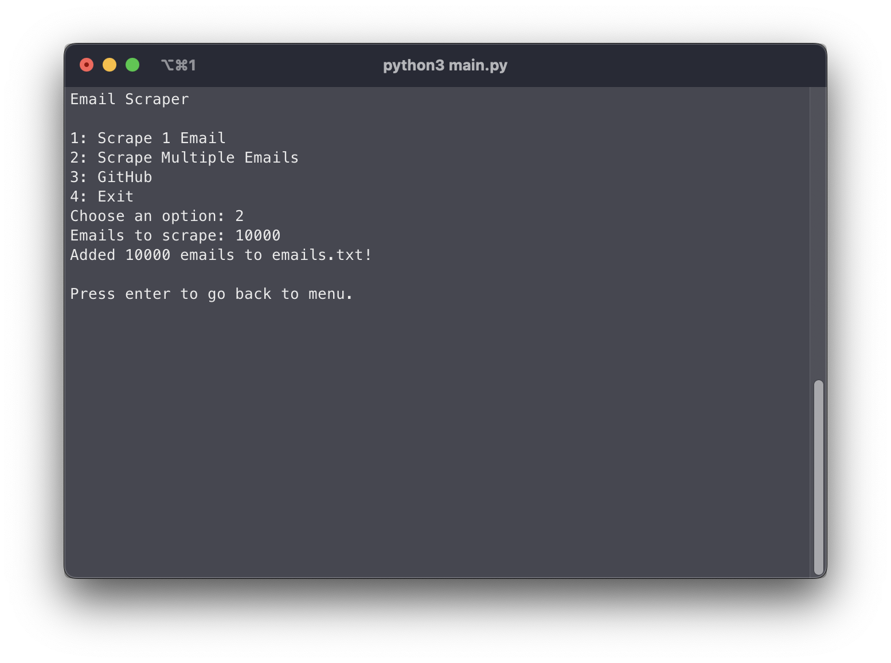

<!-- PROJECT LOGO -->
<br />
<p align="center">
  <a href="https://github.com/sanjaysunil/Email-scraper/">
    
  </a>

  <h1 align="center">Email Scraper</h1>

  <p align="center">
    A fast email scraper made with Python!    
    <br />
    <br />
    <a href="https://github.com/sanjaysunil/Email-scraper/issues/new">Report Bug</a>
    ·
    <a href="https://github.com/sanjaysunil/Email-scraper/issues/new">Request Feature</a>
  </p>
</p>

<!-- TABLE OF CONTENTS -->

## Table of Contents

- [About the Project](#about-the-project)
- [Features](#features)
- [Prerequisites](#prerequisites)
- [Installation](#installation)
- [Roadmap](#roadmap)
- [Contributing](#contributing)
- [License](#license)
- [Built With](#built-with)
- [Contact](#contact)

<!-- ABOUT THE PROJECT -->

## About The Project



**Email Scraper** is a powerful email scraper that allows you to scrape 2000 temporary emails per minute using Python! Email Scraper uses https://fyii.de/trashmail/ to scrape emails. All emails are unique.

## Features

- Fast scraping (2000 emails per minute)
- Python menu


## Prerequisites

- Email Scraper requires Python 3+ installed.
- PIP
- UUID 

## Installation

1. Clone the repo

```sh
git clone https://github.com/D3VSJ/Email-scraper
```

2. In your terminal, install UUID
```sh
pip install uuid
```

3. Run main.py 

4. Choose option 1 and start scraping

5. Check emails.txt!

## Roadmap

See the [open issues](https://github.com/sanjaysunil/Email-scraper/issues) for a list of proposed features (and known issues).

<!-- CONTRIBUTING -->

## Contributing

Contributions are what make the open source community such an amazing place to be learn, inspire, and create. Any contributions you make are **greatly appreciated**.

1. Fork the Project
2. Create your Feature Branch (`git checkout -b feature/AmazingFeature`)
3. Commit your Changes (`git commit -m 'Add some AmazingFeature'`)
4. Push to the Branch (`git push origin feature/AmazingFeature`)
5. Open a Pull Request

<!-- LICENSE -->

## License

Distributed under the MIT License. See `LICENSE` for more information.

### Built With

- [Python](https://python.org)

---

<div align="center">    

## Contact

Website : [sanjaysunil.me](https://sanjaysunil.me) &nbsp;&middot;&nbsp;
Email : [sanjaysunil@protonmail.com](mailto:sanjaysunil@protonmail.com) &nbsp;&middot;&nbsp;
Discord : [D3VSJ#3158](https://discordapp.com/users/732336924559278181)

</div>
